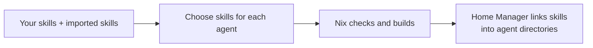

# skillset.nix

[](https://github.com/ruarfff/skillset-nix/actions/workflows/tag.yml)
[](https://nixos.org/)
[](LICENSE)

Manage your agent skills in one place and share them across coding agents.
Keep your own skills alongside copies imported from GitHub, with pinned
versions and explicit updates.



Nix supplies the tools, including Python. Home Manager manages the links in
your home directory. Importing or updating skills changes your configuration
files; build and apply the configuration to install those changes.

## Quick start

### Let your agent set it up

The [install-skillset](skills/install-skillset/SKILL.md) skill guides an agent
through setup, imports, and validation. Install it with the
[skills CLI](https://github.com/vercel-labs/skills):

```sh
npx skills add ruarfff/skillset-nix --skill install-skillset
```

Then ask: “Use install-skillset to set up skillset.nix for my agents.”
The installer uses Node.js; skillset.nix itself only needs Nix. If Nix already
manages your agent skills, declare `skills/install-skillset` from this flake
through `programs.skillset.skills` instead.

### New to Nix or Home Manager

[Install Nix](https://nixos.org/download/) on macOS or Linux and
[enable flakes](https://wiki.nixos.org/wiki/Flakes#Setup). Then copy the example:

```sh
git clone https://github.com/ruarfff/skillset-nix.git
cp -R skillset-nix/examples my-skills
cd my-skills
```

Edit these two files:

- `home.nix`: set `home.username` and `home.homeDirectory`.
- `flake.nix`: set the system to `aarch64-darwin` (Apple Silicon),
  `x86_64-darwin` (Intel Mac), `x86_64-linux`, or `aarch64-linux`.

Build, then apply:

```sh
nix build "path:$PWD#homeConfigurations.example.activationPackage"
./result/activate
```

The second command installs the example skill at `~/.agents/skills/hello`.
Edit `skills/local/hello/SKILL.md` to try it. Run both commands again after
changes. Keep the generated `flake.lock` to preserve dependency versions.
See the [Home Manager guide](https://nix-community.github.io/home-manager/nix-flakes/standalone.html)
for more setup options.

### Already using Home Manager

Add an input to your flake:

```nix
inputs.skillset.url = "github:ruarfff/skillset-nix";
```

Keep skillset’s dependency pins, especially for the optional scanner. Your
Home Manager configuration can keep its own inputs. Do not make skillset's
`nixpkgs` input follow the consumer input unless you test the CLI and scanner
with that pin.

Add `skillset.homeManagerModules.default` to your Home Manager modules, then
configure a skill and its target:

```nix
programs.skillset = {
  enable = true;
  skills.hello.path = ./skills/hello;
  targets.codex.allSkills = true;
};
```

Each skill directory needs a `SKILL.md` with a matching name and a description.
Copy the [example skill](examples/skills/local/hello/SKILL.md) to get started,
then build and apply your Home Manager configuration as usual.
See the [complete flake](examples/flake.nix) for module wiring.

### Private repositories

Nix can use your existing GitHub SSH access. A branch is sufficient:

```nix
inputs.skillset.url = "git+ssh://git@github.com/OWNER/skillset-nix?ref=main";
```

Keep the resolved `flake.lock`. This authenticates the Nix input only. CLI
imports use public GitHub archives, so declare private helper skills directly,
for example `skills.vendor-skill.path = "${skillset}/skills/vendor-skill";`.

## Choose your agents

Known target names provide default paths:

```nix
programs.skillset.targets = {
  codex.allSkills = true;       # Every declared skill
  claude.skills = [ "hello" ];  # Only these names
  opencode.allSkills = true;
};
```

Use either `allSkills` or an explicit `skills` list per target. No targets are
created until you declare them. See [supported agents and path overrides](docs/options.md#target-path-defaults).

## Add skills from GitHub

Set `programs.skillset.root = ./skills;`, then import from a **public** repository:

```sh
mkdir -p ./skills
nix run github:ruarfff/skillset-nix -- \
  --root ./skills --from ruarfff/skillset-nix --skill vendor-skill
```

The command finds the files and licence, then generates `sources.json` with
pinned versions and checksums. Repeat `--skill` for more names. An `allSkills`
target includes them on the next build and apply. See the
[import guide](docs/sources.md) for updates and optional security scanning.

## Reference

- [Scan imported and personal skills](docs/security.md), by command or agent
- [Import, update, and verify skills](docs/sources.md)
- [Options, agent paths, and live editing](docs/options.md)
- [Development and release tags](docs/development.md)

MIT licensed. See [LICENSE](LICENSE) and [provenance](NOTICE.md).
