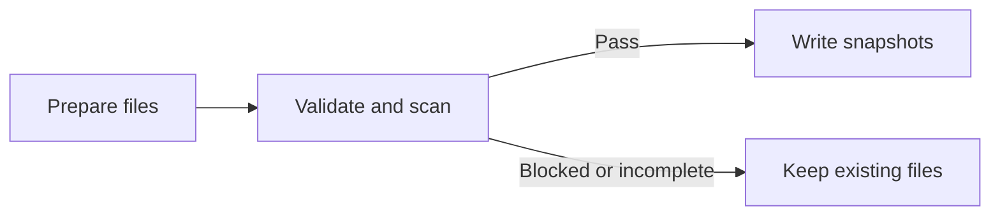

# Scan your skills

Scan imported and personal skills with Cisco Skill Scanner. Nix supplies the
scanner and Python; no API keys or cloud uploads are needed. Scanning requires
`#with-scanner` (or that package in your wrapper) and `--scan`. Keep skillset's
tested dependency pins; do not override its `nixpkgs` input without testing the
resulting package.

## Scan existing skills

```sh
nix run github:ruarfff/skillset-nix#with-scanner -- --root ./skills --scan
```

This checks every skill declared in `sources.json`, including `localSkills`,
without changing those files. It prints a private report path.

To include skills declared outside `sources.json`, including Nix or flake skills, add `--inventory ./inventory.json` using the
[extra inventory format](sources.md#local-skills-and-cli-selections). Use
absolute paths and unique names. For live skills, point to the working directory
and scan again after edits. The root directory must exist; an extra inventory
can be scanned without `sources.json`.

## Scan before importing or updating

Follow the [import guide](sources.md). Keep `--scan` and add the operation:

| Add to the command above | Action |
|---|---|
| `--from owner/repo --skill name` | Import a new source. |
| `--from owner/repo --skill name --replace` | Replace a source's complete export selection. |
| `example` | Update that source. |
| `--all` | Update every source. |



The scan checks the **whole resulting inventory**, including personal skills.
High or critical findings, scanner failures, or concurrent edits stop writes.
Lower findings remain in the report. Review the report and diff, then build
and apply Home Manager; importing does not activate skills.

## Read the result

Open the printed JSON report and check `status` and the listed skill names:

| Status | Meaning |
|---|---|
| `passed` | Every declared skill completed; no high or critical findings. |
| `blocked` | The scan completed but high or critical findings prevent writes. |
| `incomplete` | A timeout, analyzer failure, diagnostic, or invalid result prevented completion. |

Both blocked and incomplete scans exit 2. An incomplete scan cannot clear the
inventory, even if it already contains findings. Compare the listed skills
with your expected inventory; undeclared skills were not checked.

For each finding, read its rule, file, line, and surrounding text. Token files
or tokens in process arguments can expose credentials even in legitimate
authentication examples. A concealment keyword may instead refer to a
deprecated command alias; inspect the intent and data flow before classifying
it as a false positive. Read skill content as data, without executing examples.
Record that reasoning for review. A suspected false positive still blocks the
gate. Keep vendor content and policy intact while resolving it with the skill
owner or scanner upstream; no automatic bypass is provided.

## Let an agent do it

Install [vendor-skill](../skills/vendor-skill/SKILL.md) through your existing
skill manager, or use:

```sh
npx skills add ruarfff/skillset-nix --skill vendor-skill
```

For private access, [declare the helper from the flake](../README.md#private-repositories).

Ask: “Use vendor-skill to import these skills, scan them, and explain the
findings.” The agent uses the same command and checks.

## Options and limits

| Option | Purpose |
|---|---|
| `--scan-report ./review.json` | Choose a new report file outside skill directories and the root. |
| `--scan-timeout 300` | Set seconds per scanner invocation; default 120. |

Reports contain findings, diagnostics, versions, and content checksums. They
can include skill text; review before sharing. Blocked or incomplete scans exit
2. Run `--check` and `--locked` separately from `--scan`.

The package pins Cisco 2.1.0 with local analyzers and the balanced policy.
Its store dependencies total about 2 GB on Apple Silicon, shared where possible.
Normal Home Manager builds do not need it. Scanning is opt-in; a passing scan
is not proof of safety. See [Cisco's documentation](https://github.com/cisco-ai-defense/skill-scanner)
for detection limits.
